# small-swe-train: Research Mode v1.9 Design Revision Packet

Generated: 2026-02-21 06:24 UTC (original), updated 2026-03-04
Thread: 1771579678.414229
Supersedes: v1.8 at this same path

## 0) Architecture overview

```mermaid
flowchart TD
  subgraph Shared_Contracts
    MD[ModelDelimiters\nconfigs/model/*.yaml] --> TP[rollout/turn_parser.py]
    SC[schemas/contracts.py\nTOOL_SCHEMAS + validate_tool_call] --> TP
  end

  subgraph On_policy_RFT
    DS[HF dataset\nconfigs/data/*.yaml] --> TD[env/task_dataset.py]
    TD --> OC[rollout/onpolicy_collector.py]
    OC --> VG[rollout/vllm_turn_generator.py]
    OC --> CP[env/container_pool.py]
    CP --> EX[env/docker_executor.py]
    VG --> EB[verl_integration/env_bridge.py]
    EB --> EX
    EB --> RR[schemas/rollout_records.py]
    RR --> RH[trainer/rft_handoff.py\ntrainer/rft_multiturn_dataset.py]
    RH --> SFT[verl FSDP SFT\nfsdp_sft_trainer_entry.py]
  end

  subgraph Step_SDPO
    PPO[main_ppo_entry.py + ppo_runtime_patch.py] --> LOOP[swe_bridge_agent_loop.py]
    LOOP --> EB2[env_bridge + DockerToolExecutor]
    EB2 --> VER[submission_verifier.py]
    VER --> FB[data/feedback_canonicalizer.py]
    FB --> RW[reward_adapter.py + reward_function.py]
    FB --> RP[reprompt_adapter.py + mask_injector.py]
    RW --> PPO
    RP --> PPO
  end
```



## 1) Chat contract for Qwen3-4B

### 1.1 Decision
- ChatML-style turn framing for Qwen3-4B.
- Turn boundaries: `<|im_start|>{role}` / `<|im_end|>`.

### 1.2 Intra-turn delimiters (assistant payload)
1. Optional thinking block: `<think> ... </think>`
2. One or more tool-call blocks: `<tool_call>{"tool":"...","args":{...}}</tool_call>`
3. Tool/environment feedback: `<tool_response> ... </tool_response>`

### 1.3 Implementation status
- **All delimiter strings are config-driven.** Loaded from YAML via the `ModelDelimiters` dataclass in `src/prompts/model_delimiters.py`.
- Resolution order: `configs/model/<family>.yaml` overrides → bundled `src/prompts/model_configs/<family>.yaml` defaults (via `resolve_model_config_path()`).
- `load_delimiters(path)` for explicit overrides; `default_delimiters(model_family="qwen3")` is cached.
- `TurnParser` in `src/rollout/turn_parser.py` accepts `ModelDelimiters`; module-level convenience helpers use the default.
- Prompt-side constants (`CHATML_START`, `TOOL_CALL_START`, etc.) are derived from the default delimiters in `src/prompts/runtime_messages.py`.

## 2) One tool vs multiple tools per turn

### 2.1 Policy
- Allow `1..M` tool calls per assistant turn (`M=3` default, configurable).
- Calls are executed sequentially in listed order.
- If `submit` appears, it must be the only call in that turn (terminal).

### 2.2 Implementation status
- Enforced by `ActionEnvelope.__post_init__`, `TurnParser`, and `run_env_bridge_step` using `MAX_TOOL_CALLS_PER_TURN` from `src/config.py`.

## 3) Tool set and terminal action

### 3.1 Canonical tools
`bash`, `read`, `file_search`, `text_search`, `apply_patch`, `submit` — defined in `ALLOWED_TOOLS` ordered tuple.

### 3.2 Tool schema registry
- `TOOL_SCHEMAS` in `contracts.py` maps each tool to its TypedDict, required fields, and constraints.
- `validate_tool_call()` checks parsed `ToolCall` instances against the registry (required args, unknown args, types, min_length, min/max range).
- **JSON Schema files removed.** Validation is Python-native.

### 3.3 Legacy alias handling
- `answer` → `submit` and `edit` → `apply_patch` via `canonical_tool_name()` in `schemas/contracts.py`.
- `str_replace_editor` subcommands mapped via `data/tool_schema_adapter.py`.

## 4) Default turn-SDPO teacher prompt construction per turn

At turn `t`, teacher prompt is:
1. `INITIAL_PROMPT_BLOCK` — reconstructed from raw prompt messages (role-tagged) or fallback task text.
2. `TRAJECTORY_BLOCK` — `RECENT_RAW_BLOCK` + `COMPRESSED_MEMORY_BLOCK` + `CRITICAL_FACTS_BLOCK`.
3. `CURRENT_ATTEMPT_BLOCK` — student attempt (included by default, flag retained for ablation).
4. `FEEDBACK_BLOCK` — canonicalized tool feedback plus optional verifier feedback block.
5. `OUTPUT_CONTRACT_BLOCK` — tool/output contract for teacher actions (next-turn or current-turn supervision).

### Implementation status
- `teacher/prompt_builder.py` — `TeacherPromptInputs`, `build_teacher_prompt()`, and `build_trajectory_block()` assemble the block structure.
- `teacher/memory_builder.py` — placeholder compression/fact extraction; returns empty memory blocks by default.
- `prompts/teacher_messages.py` — `build_teacher_output_contract_block()` provides the OUTPUT_CONTRACT text.
- `verl_integration/reprompt_adapter.py` — builds blocks from rollout rows, injects verifier feedback, and applies max-token compaction.

## 5) Self-containment checks and canonicalization

### 5.1 Programmatic checks
Computed from canonical feedback fields (when `feedback_processing.extract_self_containment_signals` is enabled): `has_failing_artifact_identity`, `has_actionable_error_text`, `has_localization_hint`.

### 5.2 Policy
- `include_student_attempt_for_teacher` defaults to `true` (not derived from self-containment in v1.6+).
- In `turn_supervision_mode=current_turn`, the current assistant turn is kept verbatim in the teacher prompt when `include_student_attempt_for_teacher=true`.
- Flag retained in schema for future ablation.

### 5.3 Implementation status
- `data/feedback_canonicalizer.py` — `normalize_text`, deterministic truncation, optional self-containment extraction (gated via `resolve_feedback_self_containment_signals_enabled()`), `build_feedback_packet()`.
- `verl_integration/env_bridge.py` — truncates tool-output payloads before emitting `<tool_response>` blocks.
- Tested via `test_feedback_canonicalizer.py` and `test_verl_env_bridge.py`.

## 6) Stage-specific token masking policy

| Stage | Assistant action supervision |
|-------|------------------------------|
| format-RFT | assistant turns (`think` + `tool_call`) |
| positive-RFT | assistant turns (`think` + `tool_call`) |
| turn-SDPO | assistant turns (`think` + `tool_call`) |

### Implementation status
- `losses/action_masking.py` — `should_train_token()` + `build_action_token_mask()` implemented and tested.
- `verl_integration/mask_injector.py` — injects stage-aware response masks for verl batches.

## 7) Tool schema alignment with SWE-bench / SWE-smith

### 7.1 Adapter mapping (deterministic)
- `bash` → `bash`
- `str_replace_editor.view` → `read`
- `str_replace_editor.create|str_replace|insert|undo_edit` → `apply_patch`
- `submit`/`answer` → `submit`
- `edit` → `apply_patch`

### 7.2 Implementation status
- `data/tool_schema_adapter.py` — `map_external_tool()` + `adapt_external_tool_call()` implemented and tested; canonical aliases handled in `schemas/contracts.py`.

## 8) Directory layout

```text
small-swe-train/
  AGENTS.md
  README.md
  STATUS.md
  docs/
    design.md                    # architecture, data flow, milestones
  pyproject.toml
  configs/
    runtime/
      training_policy_defaults.v1.json
      phase_transition_gates.v1.json
    data/
      on_policy_swe_smith.yaml
    model/
      qwen3.yaml
      README.md
    verl/                        # verl/SDPO training configs
      model_defaults.yaml
      sdpo_swe.yaml              # turn-SDPO (main objective)
      rft_swe.yaml               # RFT supervised pre-training
      user.yaml                  # user-local path overrides
      agent_loops/
        swe_bridge_agent.yaml
  src/
    config.py
    runtime_paths.py
    schemas/
      contracts.py            # TOOL_SCHEMAS, validate_tool_call, data types
      rollout_records.py      # RolloutRow schema
    prompts/
      model_delimiters.py      # ModelDelimiters, load_delimiters
      runtime_messages.py      # assistant contract + on-policy prompt text
      teacher_messages.py      # teacher output contract block
      model_configs/
        qwen3.yaml             # bundled delimiter config
    data/
      feedback_canonicalizer.py
      tool_schema_adapter.py
      tokenization.py          # shared offset-based tokenization + batch support
    env/
      runtime_protocol.py      # ToolRequest, ToolResponse, EnvironmentStep
      docker_executor.py       # DockerToolExecutor
      container_pool.py        # BatchContainerPool
      command_runner.py
      task_dataset.py
      preload_sdpo_dataset.py
    rollout/
      turn_parser.py           # TurnParser class
      vllm_turn_generator.py   # vLLM OpenAI-compatible turn generator
      onpolicy_collector.py    # rollout collector + Docker dispatch
    teacher/
      prompt_builder.py
      memory_builder.py
    trainer/
      rft_runtime_loop.py
      rft_runtime.py
      rft_handoff.py
      rft_multiturn_dataset.py
      rft_rejection.py
      rft_trainer.py
      sdpo_trainer.py
      vllm_api_server_entry.py
    losses/
      action_masking.py
    metrics/
      contracts.py             # FormatMetrics, rate()
    verl_integration/            # adapter layer: our modules ↔ verl
      main_ppo_entry.py
      ppo_runtime_patch.py
      swe_bridge_agent_loop.py
      env_bridge.py
      reward_function.py
      reward_adapter.py
      reward_loop_score.py
      reprompt_adapter.py
      mask_injector.py
      data_preprocessor.py
      onpolicy_rollout_adapter.py
      onpolicy_rft_dataset.py
      rft_runtime.py
      rft_rejection.py
      fsdp_sft_trainer_entry.py
      submission_verifier.py
    sitecustomize.py
    small_swe_runtime_patches.py
  scripts/
    run_rft.sh
    run_sdpo.sh
    run_step_sdpo_scaffold.py
    run_rft_onpolicy_rollout_proof.sh
    check_sdpo_turn_integrity.py
    run_flash_attn_rebuild.sh
    SLURM_GPU_LAUNCH.md
  tests/
    test_*.py
```

SDPO launch ops note: `scripts/run_sdpo.sh` expects Slurm; see `scripts/SLURM_GPU_LAUNCH.md`
for Ray/tmpdir and cleanup guidance. The launcher defaults
`SMALL_SWE_ENABLE_SDPO_RUNTIME_PATCH=1` and `TOKENIZERS_PARALLELISM=false`.

## 9) Deeper adaptation notes for `lasgroup/SDPO`

### 9.1 Integration hooks (current code)
- `src/verl_integration/main_ppo_entry.py` is the SDPO entrypoint; applies `small_swe_runtime_patches` and the SDPO runtime patch before launching verl.
- `src/verl_integration/ppo_runtime_patch.py` patches `RayPPOTrainer` hooks (`_compute_or_extract_reward`, `_maybe_build_self_distillation_batch`, agent-loop routing) to wire SWE-bridge reward + reprompting.
- `src/verl_integration/swe_bridge_agent_loop.py` registers the SWE bridge agent loop and executes Docker-backed tool calls + verification.

### 9.2 Custom behavior implemented
1. Parser supports multi-tool-call turns with ordered block extraction.
2. Loss-mask builder supports stage-specific think-token behavior.
3. Canonicalization preserves `actionable_error_text` and self-containment diagnostics (config-gated).
4. Teacher prompt builder includes student attempt by default; gating retained.
5. Terminal tool is `submit` (not `answer`).
6. Reward adapter bridges verl `DataProto` → row-wise reward/feedback (`reward_adapter.py` + `reward_function.py`).
7. SDPO reward semantics are subtraction-based: start at `1.0` when verifier targets exist, subtract `1.0` each for missing `fail_to_pass` or `pass_to_pass` verification, then apply `TERMINAL_VALIDITY_PENALTY` when the terminal submit contract is violated.
8. System prompt is always enforced for SDPO and pilot teacher reprompts: SDPO agent-loop prepends `build_onpolicy_system_prompt()` to incoming messages, and pilot teacher requests reuse the baseline raw prompt messages (with system prompt) or fall back to the same system contract.

## 10) Implementation progress

### Core contracts + prompting (done)
| Module | Key exports | Tests |
|--------|------------|-------|
| `schemas/contracts.py` | `TOOL_SCHEMAS`, `validate_tool_call`, `ToolCall`, `ActionEnvelope`, `FeedbackPacket` | `test_turn_parser.py`, `test_tool_schema_adapter.py` |
| `schemas/rollout_records.py` | `RolloutRow` typed records | `test_onpolicy_collector.py` |
| `prompts/model_delimiters.py` | `ModelDelimiters`, `load_delimiters`, `default_delimiters` | `test_model_delimiter_resolution.py` |
| `prompts/runtime_messages.py` | `build_assistant_contract_prompt`, `build_onpolicy_system_prompt` | `test_config_authority.py` |
| `prompts/teacher_messages.py` | `build_teacher_output_contract_block` | `test_teacher_messages.py` |
| `rollout/turn_parser.py` | `TurnParser`, `parse_chatml_assistant_turn` | `test_turn_parser.py` |

### On-policy runtime + env (done)
| Module | Key exports | Tests |
|--------|------------|-------|
| `env/docker_executor.py` | `DockerToolExecutor` | `test_docker_executor.py` |
| `env/container_pool.py` | `BatchContainerPool` | `test_container_pool.py` |
| `env/task_dataset.py` | `TaskSample`, `load_task_batch`, parquet preload helpers | `test_task_dataset.py`, `test_preload_sdpo_dataset.py` |
| `rollout/vllm_turn_generator.py` | `build_vllm_turn_generator` | `test_vllm_turn_generator.py` |
| `rollout/onpolicy_collector.py` | `OnPolicyRolloutCollector` | `test_onpolicy_collector.py` |
| `verl_integration/env_bridge.py` | `run_env_bridge_step` | `test_verl_env_bridge.py` |

### Training + verl integration (done; live runs require GPU/Slurm)
| Module | Key exports | Tests |
|--------|------------|-------|
| `trainer/rft_runtime_loop.py` | `run_rft_runtime_loop` orchestration | `test_rft_runtime_loop.py` |
| `trainer/rft_runtime.py` | on-policy runtime batch collection | `test_rft_runtime.py` |
| `trainer/rft_trainer.py` | `RFTTrainer` scaffold | — |
| `trainer/rft_handoff.py` | rollout → parquet handoff + selection | `test_onpolicy_rollout_adapter.py` |
| `trainer/rft_multiturn_dataset.py` | multiturn dataset assembly | `test_rft_multiturn_dataset.py` |
| `trainer/vllm_api_server_entry.py` | vLLM server entrypoint | `test_vllm_api_server_entry.py` |
| `verl_integration/onpolicy_rollout_adapter.py` | compatibility wrapper for RFT handoff utilities | `test_onpolicy_rollout_adapter.py` |
| `verl_integration/onpolicy_rft_dataset.py` | `OnPolicyRFTDataset` | `test_onpolicy_rft_dataset.py` |
| `verl_integration/data_preprocessor.py` | `preprocess_trajectories` | `test_verl_data_preprocessor.py` |
| `verl_integration/reward_adapter.py` | DataProto ↔ row reward bridge | `test_verl_reward_adapter.py` |
| `verl_integration/reward_function.py` | `reward_fn` scoring | `test_verl_reward_function.py` |
| `verl_integration/reward_loop_score.py` | reward-loop scoring helper | `test_verl_reward_loop_score.py` |
| `verl_integration/reprompt_adapter.py` | teacher prompt assembly + truncation | `test_verl_reprompt_adapter.py` |
| `verl_integration/mask_injector.py` | stage-aware response masks | `test_verl_mask_injector.py` |
| `verl_integration/ppo_runtime_patch.py` | RayPPOTrainer hook patching | `test_ppo_runtime_patch.py` |
| `verl_integration/swe_bridge_agent_loop.py` | SDPO agent loop + Docker tools | `test_swe_bridge_agent_loop.py` |
| `trainer/sdpo_trainer.py` | `SDPOTrainerScaffold` | `test_sdpo_trainer.py` |

### Remaining gaps / TODO
| Component | Description | Notes |
|-----------|-------------|-------|
| **Teacher memory compression** | Implement real compression/critical-fact extraction in `teacher/memory_builder.py`. | Currently returns empty blocks. |
| **Live GPU validation** | Run `scripts/run_rft.sh` + `scripts/run_sdpo.sh` on Slurm with vLLM/Ray to validate full loops. | Requires external infra. |
| **Benchmark stage** | Choose a current benchmark target, define prediction artifacts, and implement a scoring runner. | No active benchmarking stage exists; SDPO currently has only in-loop verifier-backed validation. |

## 11) Bug-fix log (v1.9, 2026-03-05)

Four regressions/oversights were corrected in the pilot + SDPO paths, each
with explicit regression coverage or test updates. These updates align reward
semantics and prompt construction with the agreed contracts.

| # | File | Bug | Fix |
|---|------|-----|-----|
| 1 | `scripts/run_teacher_reprompt_pilot.py` | Pilot ablation used a dummy reward function, so student/teacher deltas were meaningless | Swap to `reward_fn` from `reward_function.py` for both baseline + teacher rows; record `reward_delta` from real verifier-based scores |
| 2 | `scripts/run_teacher_reprompt_pilot.py`, `src/verl_integration/swe_bridge_agent_loop.py` | Teacher reprompt requests did not consistently include the system prompt (pilot + SDPO), yielding off-contract generations | Always inject `build_onpolicy_system_prompt()` into SDPO agent-loop messages; pilot teacher requests now reuse the baseline raw prompt messages (including system prompt) or fall back to the same contract |
| 3 | `src/verl_integration/reward_function.py` | SDPO reward logic was incorrectly gated on submit-only signals instead of subtraction-based verifier deltas | Implement subtraction-based reward: `1.0` base when verifier targets exist, subtract for each failed verification group, then apply terminal validity penalty |
| 4 | `src/env/docker_executor.py` | `text_search` tool fallback emitted stderr but never executed `grep -R` after fallback | Ensure fallback path still runs `grep -R` and avoid suppressing errors (`|| true` / `2>/dev/null`) so failures are visible |

## 11.1) Prior bug-fix log (v1.8, 2026-02-22)

Seven bugs were identified and fixed in the verl integration layer. All fixes
have regression tests in `tests/`.

| # | File | Bug | Fix |
|---|------|-----|-----|
| 1 | `env_bridge.py` | Submit early-return bypassed `validate_tool_call`, so malformed submit payloads (missing `final_response`) silently ended episodes | Validate submit call before terminal return; surface errors in `steps` and `tool_response_blocks` |
| 2 | `reprompt_adapter.py` | `has_teacher_signal` derived from `bool(feedback_block.strip())`; empty `tool_output` canonicalizes to `'{}'` which is truthy, flipping the distillation mask on for rows with no signal | Use `feedback_packet.self_containment_checks.has_actionable_error_text` instead |
| 3 | `reward_function.py` | `step_index` coercion failures were appended to `sample_errors` and gated the reward, zeroing out valid resolved samples with bad metadata | Separate `step_index_warnings` from format `validation_errors`; only format errors gate reward |
| 4 | `reprompt_adapter.py` | `_truncate_prompt_tokens` used `" ".join(tokens[:N])`, collapsing newlines into spaces and destroying the 6-block teacher prompt structure | Line-aware truncation: split by `\n`, count whitespace words per line, preserve newlines |
| 5 | `data_preprocessor.py` | `_labels_from_envelope` sized per-token masks via `len(text.split())` (whitespace words), producing masks that won't align with subword tokenizer output | Renamed to `_approx_labels_from_envelope` with warning; added `label_blocks` output with structured `{type, text}` block metadata for tokenizer-aligned mask generation |
| 6 | `data_preprocessor.py` | Non-string `thinking` field (e.g. int) passed to `ActionEnvelope` caused `AttributeError` on `.strip()` | Coerce `thinking` to `str(value)` when non-None and non-string |
| 7 | `rft_swe.yaml` / `sdpo_swe.yaml` | No LoRA configuration despite blueprint memory budget assuming LoRA (optimizer states ~0.05 GB vs ~8+ GB for full fine-tuning) | Added `lora:` block with `rank=64`, `alpha=128`, targets `q_proj/k_proj/v_proj/o_proj` |

## 12) Recommended next steps (priority order)

1. **Run end-to-end RFT loop on Slurm** — Use `scripts/run_rft.sh` (or `trainer/rft_runtime_loop.py`) with a live vLLM server and Docker task images to validate rollouts, handoff parquet, and LoRA SFT training (`configs/verl/rft_swe.yaml`).

2. **Validate SDPO PPO runtime** — Use `scripts/run_sdpo.sh` with `configs/verl/agent_loops/swe_bridge_agent.yaml` to confirm `ppo_runtime_patch.py` hooks, `swe_bridge_agent_loop.py` tool execution, reward/reprompt flow, and container cleanup.

3. **Implement teacher memory compression** — Replace the placeholder logic in `teacher/memory_builder.py` with real summarization / critical-facts extraction.

4. **Define the benchmark stage** — Choose the benchmark target and artifact/scoring contract before implementing post-training evaluation.

## 13) Training infrastructure decision

### 13.1 Framework
- **Trainer & rollout**: `lasgroup/SDPO` (a fork of [verl](https://github.com/verl-project/verl)) used as-is.
- **Rollout engine**: vLLM (via verl's colocated rollout worker).
- **Training engine**: FSDP `FULL_SHARD` across 8 GPUs (via verl's `DataParallelPPOActor`).
- FSDP is needed not for model size (Qwen3-4B ≈ 8 GB bf16) but for **activation memory headroom** with long SWE-bench trajectories (8K–16K tokens).

### 13.2 Hardware target
- Single node, 8× A100 or H100 GPUs (80 GB each).
- GPUs alternate between vLLM inference and FSDP training each global step.

### 13.3 Config files
- `configs/verl/model_defaults.yaml` — shared model defaults (primary training model name).
- `configs/verl/sdpo_swe.yaml` — turn-SDPO training (main objective).
- `configs/verl/rft_swe.yaml` — RFT supervised pre-training.
- `configs/verl/user.yaml` — user-local path overrides.
- `configs/verl/agent_loops/swe_bridge_agent.yaml` — SDPO agent-loop runtime config.

### 13.4 Integration layer
- New package `src/verl_integration/` bridges our protocol modules with verl hooks.
- SDPO entrypoint: `src/verl_integration/main_ppo_entry.py` (applies runtime patches + registers agent loop).
- RFT SFT entrypoint: `src/verl_integration/fsdp_sft_trainer_entry.py` (FlashAttention compatibility guard).
- Full architecture, data flow, and milestone plan live in this design packet.

## 14) Sources
- Qwen3 tokenizer chat template: https://huggingface.co/Qwen/Qwen3-4B/blob/main/tokenizer_config.json
- SDPO baseline: https://github.com/lasgroup/SDPO
- verl framework: https://github.com/verl-project/verl
- Thread review: https://github.com/murphytheagent/small-swe-train/pull/2#discussion_r2835868321
- Implementation blueprint: `design.md` (this directory)
